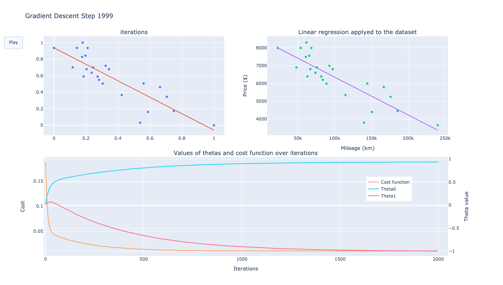
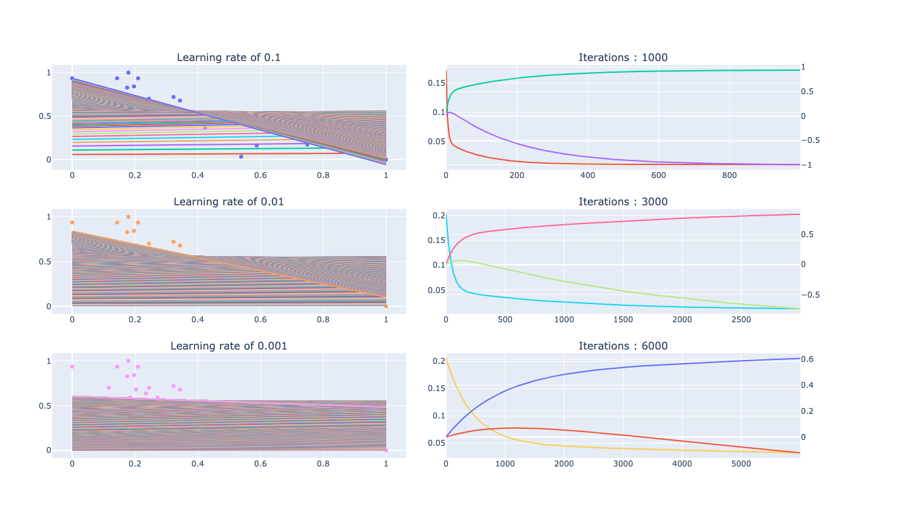
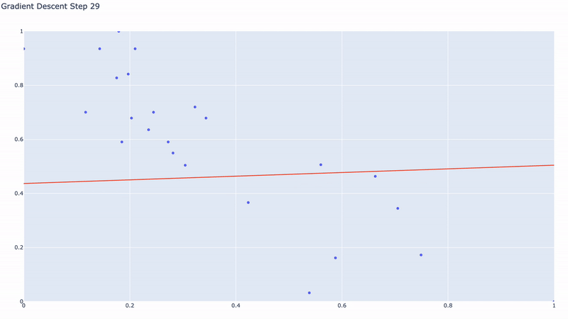

# ft_linear_regression - School 42 Paris

## Objective :

The aim of this project is to introduce the basic concept behind machine learning. For this project I had to create a program that predicts the price of a car by
using a linear function train with a gradient descent algorithm.

There is on file (estimation.py) that prompt the user to enter a mileage and then calculate the price based on the the "thetas" calculated from the data file. And a second one (GradientDescent.py) that will apply the gradient descent algorithm on the data file, some outputs will show all stages done to achieve this result.

## Usage :   

Create virtual envirement by running `python3 -m venv venv` then activate it with `source venv/bin/activate`  

Install all dependencies by running `pip install -r requirements.txt`  

Then :
```
python GradientDescent.py
python estimation.py
```
In [files directory](files/) there are HTML files that can be opened directly from a browser to see all graphs.

## Graphs:





## Sources :

[Wiki : Linear regression](https://en.wikipedia.org/wiki/Linear_regression)  
[Basic explanation](https://machinelearningmastery.com/linear-regression-for-machine-learning/)  
[Some math explanation](https://towardsdatascience.com/mathematics-for-machine-learning-linear-regression-least-square-regression-de09cf53757c)  

